# Thermal-Aware AI Inference Pipeline (Jetson Orin)

## Author

-Roman Bonfiglio

## Overview
This project implements a thermal-aware, concurrent AI inference pipeline designed for the NVIDIA Jetson Orin Nano. This system runs a sustained AI inference workload while balancing camera throughput against thermal limits. It senses SoC thermal state directly from the Linux kernel and dynamically adjusts pipeline behavior in response.

## Technologies

- **Languages:** C++, C
- **OS:** Embedded Linux
- **Hardware:** NVIDIA Jetson Orin Nano
- **AI:** TensorRT, CUDA, YOLOv8n
- **Camera:** OpenCV, V4L2
- **Kernel:** Linux Kernel Modules, Thermal Framework, Character Devices
- **Interfaces:** `ioctl`, `mmap`
- **Concurrency:** POSIX threads, custom ring buffer
- **Debugging:** GDB, ThreadSanitizer, AddressSanitizer, Valgrind

It has three main stages

1. **User-space concurrency engine** — a multi-threaded C++ producer/consumer/governor pipeline with a custom ring buffer and drop-based backpressure policy
2. **Kernel-space thermal bridge** — a custom Linux character device driver that reads real thermal zone data from the kernel and exposes it to user space
3. **Full integration** — real V4L2 camera input and TensorRT inference tied to the kernel-driven thermal governor

```mermaid
%%{init: {'theme':'base', 'themeVariables': {
    'primaryColor':'#ffffff',
    'primaryTextColor':'#111111',
    'primaryBorderColor':'#333333',
    'lineColor':'#555555',
    'secondaryColor':'#ffffff',
    'tertiaryColor':'#ffffff',
    'fontSize':'18px'
}}}%%

flowchart LR
    A["Camera<br/>OpenCV / V4L2"] -->|Frames| B["Ring Buffer<br/>Drop-on-Full"]
    B -->|Pop| C["TensorRT<br/>YOLOv8n Inference"]
    C -->|Detections + Latency| F["Console / Results"]

    D["Kernel Driver<br/>orin_thermal.ko"] -->|ioctl: GPU / CPU °C| E["Governor Thread<br/>Thermal FSM"]
    E -->|Thermal State| A
    E -->|Thermal State| C

    style A fill:#ffffff,stroke:#333333,stroke-width:2px
    style B fill:#ffffff,stroke:#333333,stroke-width:2px
    style C fill:#ffffff,stroke:#333333,stroke-width:2px
    style D fill:#ffffff,stroke:#333333,stroke-width:2px
    style E fill:#ffffff,stroke:#333333,stroke-width:2px
    style F fill:#ffffff,stroke:#333333,stroke-width:2px

    linkStyle default stroke:#555555,stroke-width:2px
```


 


## Phase 1: User-Space Concurrency Engine (Complete)

### What it does
- Producer thread simulates camera frame ingestion
- Consumer thread simulates TensorRT inference
- Governor thread runs a thermal FSM (NORMAL/WARM/HOT/CRITICAL) with hysteresis
- Fixed-size ring buffer connects them with a drop-on-full backpressure policy

### Key design decisions
- **Drop-incoming vs overwrite-oldest**: chose drop-incoming so frame ordering 
  is preserved and backpressure produces an explicit, countable metric 
  rather than a silent overwrite
- **Hysteresis in the FSM**: asymmetric enter/exit thresholds per state 
  prevent oscillation when temperature hovers near a boundary

### Validation
- Verified with ThreadSanitizer (clean across multiple runs, varied durations)
- Verified with AddressSanitizer (clean)
- Verified with Valgrind (no memory leaks)


## Repository Structure
src/        - source files

include/    - headers

## Phase 2: Kernel-Space Thermal Bridge (Complete)
 
### What it does
- Custom Linux loadable kernel module (`orin_thermal.ko`) implementing a character
  device at `/dev/JETSON`
- Reads real GPU and CPU junction temperatures directly from the Jetson's Tegra SoC
  via the Linux kernel's built-in thermal framework — not simulated or hardcoded data
- Exposes telemetry to user space through a structured `ioctl` interface, and
  demonstrates a zero-copy `mmap` interface for high-frequency access
- The Phase 1 governor thread now consumes this real hardware telemetry in place
  of the earlier simulated random-walk temperature model, closing the loop between
  kernel-space sensing and the user-space FSM
### Kernel Module Interfaces
 
**Character device registration**
- Dynamic major number allocation via `alloc_chrdev_region`, with `cdev_init`/`cdev_add`
  registering the device against a custom `file_operations` table
- `class_create`/`device_create` used to expose the device at `/dev/JETSON`
**ioctl interface** — the primary telemetry path
- `JETSON_THERMAL_GPU_READ` / `JETSON_THERMAL_CPU_READ` — return a structured
  `struct thermal_telemetry` (temperature in whole degrees Celsius, FSM state)
  pulled live from the kernel's thermal framework at the moment of the call
- `JETSON_THERMAL_WRITE` / `JETSON_THERMAL_RESET` — scaffolding for driver-side
  configuration (e.g. adjustable thresholds), implemented and validated but not
  yet load-bearing in the current pipeline
- Chosen over a plain `read()` interface because the driver needed to return
  multiple typed fields per call rather than an unstructured byte stream; an
  initial `read()` implementation was used early on to validate character device
  registration and was removed once `ioctl` replaced it, to avoid maintaining a
  redundant, superseded interface
**mmap interface** — zero-copy access, demonstrated independently
- A dedicated physically-contiguous page (`get_zeroed_page`) is mapped directly
  into user-space via `remap_pfn_range`, allowing a user-space program to read
  telemetry through a plain pointer dereference with no syscall per access
- Chosen over `vmalloc` specifically because the telemetry struct is small enough
  to fit in a single page, and `remap_pfn_range` requires physically contiguous
  memory 
- Validated end-to-end with a standalone user-space test program: confirmed the
  mapped memory reflects driver-written values, and that repeated reads after the
  initial `mmap()` call trigger no further kernel code execution

### Validation
- Character device load/unload cycle confirmed clean via `dmesg`, with
  `/dev/JETSON` correctly appearing and disappearing on `insmod`/`rmmod`
- ioctl GPU/CPU reads validated against a standalone user-space test program,
  confirming live, changing values across repeated calls (not a cached or
  hardcoded result)
- mmap validated against a standalone user-space test program using `mmap()`
  and `munmap()`, confirming correct zero-copy access to driver-written data
- Full pipeline integration validated by wiring real ioctl-sourced GPU
  temperature into the Phase 1 governor thread, replacing the simulated
  temperature model and driving the same FSM logic against live hardware data

## Phase 3: Full Integration (Complete)
Real camera frames flow through the ring buffer into actual TensorRT object detection, with the kernel-sourced thermal governor throttling both based on live GPU/CPU temperature — the full loop from real hardware sensing to real AI inference, running end to end.
 
- Real camera capture (OpenCV, V4L2 backend, MJPG @ 640x480/30fps) replaces Phase 1's synthetic frames
- **V4L2 over GStreamer:** the installed OpenCV build lacked GStreamer support; V4L2 direct capture was simpler and lower-overhead for a single-camera pipeline than rebuilding OpenCV from source
- Frames are explicitly deep-copied (`cv::Mat::clone()`) before entering the ring buffer, rather than relying on shallow reference-counted copies that could alias camera-driver-owned memory
- TensorRT engine and GPU buffers loaded/allocated once at startup, reused per frame; dedicated CUDA stream avoids default-stream synchronization overhead
- Consumer sleep redesigned: NORMAL/WARM throughput now governed by real inference cost alone; deliberate additional sleep retained only in HOT/CRITICAL as genuine protective throttling
### Debugging Highlight
Frame IDs intermittently appeared out of sequence with no corresponding drops recorded. Ruled out, in order: multiple running instances, V4L2-level frame reordering, and `cv::Mat` buffer aliasing. Root cause, found via direct `push()`/`pop()` instrumentation rather than inferring from interleaved console output: an **uninitialized `current_count` member** in the `RingBuffer` constructor — present since Phase 1, masked by coincidentally zero-valued memory in smaller test programs, only surfacing once TensorRT/CUDA/OpenCV's larger memory footprint made the garbage value non-zero.
 
### Validation
- Live camera feed and real detections (bounding boxes) confirmed visually
- Frame sequencing verified gapless/monotonic post-fix via ring buffer instrumentation
- Thermal-load tested with the fan disabled to observe genuine sustained-load behavior, cross-checked against `tegrastats`
## Build & Run
```bash
g++ -std=c++17 -pthread main.cpp RingBuffer.cpp -I../../include \
    -I/usr/include/opencv4 -I/usr/include/aarch64-linux-gnu -I/usr/local/cuda-12.6/include \
    -L/usr/lib -L/usr/lib/aarch64-linux-gnu -L/usr/local/cuda-12.6/lib64 \
    -lopencv_videoio -lopencv_imgproc -lopencv_core -lopencv_dnn \
    -lnvinfer -lcudart \
    -o thermal_pipeline
 
sudo insmod ../Phase_2_kernel/orin_thermal.ko   # kernel module must be loaded first
sudo ./thermal_pipeline                          # sudo required for /dev/JETSON access
```
```
g++ -std=c++17 -pthread src/main.cpp src/RingBuffer.cpp -Iinclude -o thermal_sim
./thermal_sim
```
 
